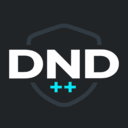

  

<h1 align="center">🔕 DoNotDisturb++</h1>

  🏆 <strong>Winner — Stuttgart Hackathon 2026 (1st place)</strong>

---

**DoNotDisturb++** is a VS Code extension designed to help you **focus deeply** by taking control of your notifications — instead of letting them control you.

Rather than muting everything, DoNotDisturb++ allows you to **categorize notifications by importance and context**, so you stay informed without breaking your flow.  
Critical alerts get through. Noise stays out.

Built for developers who value **productivity, clarity, and uninterrupted focus**.

---

## ✨ Key Features
- Categorize notifications by priority  
- Reduce distractions without missing what matters  
- Stay focused during deep work sessions  
- Seamless integration with VS Code  

---

## 🛒 Availability

DoNotDisturb++ is available on the **VS Code Marketplace**:  
👉 https://marketplace.visualstudio.com/items?itemName=crasyK.donotdisturb-plus-plus

---

Focus smarter. Code better.
